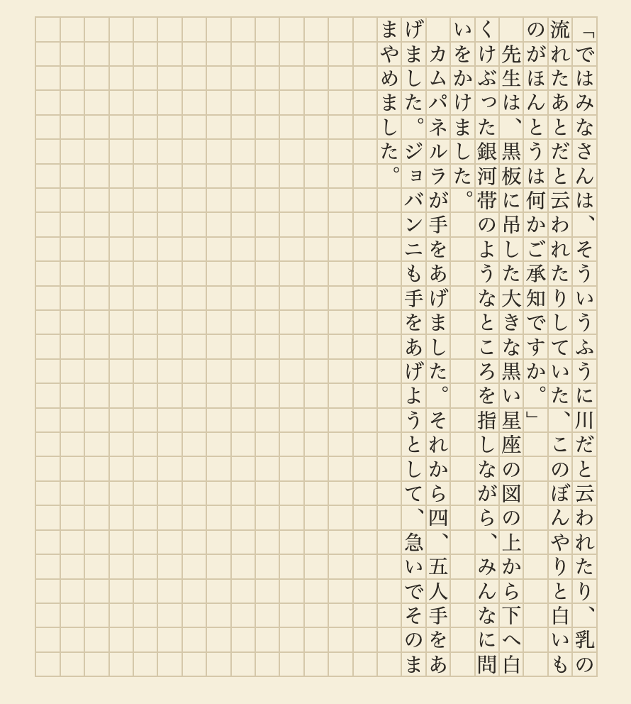

# kg

[](https://go.dev/)
[](https://github.com/sushichan044/kg/actions/workflows/ci.yml)
[](https://github.com/sushichan044/kg/releases/latest)

**kg** は、`.txt` で書いた小説やショートストーリーを縦書きの原稿用紙に仮組みするローカルプレビューアーです。
字数、行数、段数、用紙などを変えながら、文章の密度とページ全体の見た目をブラウザで確認できます。



## インストール

> [!CAUTION]
> バイナリをビルドする際にプレビュー画面もビルドする必要があるので、現状 `go install` には対応していません

[GitHub Releases](https://github.com/sushichan044/kg/releases/latest) から、利用する OS とアーキテクチャに合うアーカイブをダウンロードします。
アーカイブを展開し、`kg`（Windows では `kg.exe`）を `PATH` の通ったディレクトリへ配置してください。

リリースには macOS、Linux、Windows 用の実行ファイルが含まれます。

### mise を利用している場合

<https://mise.jdx.dev/>

```bash
mise install github:sushichan044/kg
```

## 原稿を表示する

ファイルまたはディレクトリを指定して `kg` を実行します。

```bash
kg manuscript.txt
kg novel/
```

ディレクトリを指定すると、その配下にある `.txt` ファイルを再帰的に監視します。
引数を省略した場合は、現在のディレクトリが監視対象です。

```bash
cd path/to/novel
kg
```

既定では、`kg` はバックグラウンドでサーバーを起動してブラウザを開き、シェルへ制御を戻します。
起動済みの `kg` に別のパスを渡すと、起動中のサーバーに監視するファイルを追加することができます。

監視中のファイルを追加、編集、移動、削除すると、ブラウザの表示も更新されます。

## 原稿用紙の設定

画面のサイドバーから、原稿用紙と紙面の設定を変更できます。

| 設定     | 選択肢                           | 既定値 |
| -------- | -------------------------------- | ------ |
| 字数     | 10〜60字                         | 27字   |
| 行数     | 10〜60行                         | 23行   |
| 段数     | 1〜3段                           | 2段    |
| 用紙     | A4、A5、B5（JIS）、B6（JIS）     | A5     |
| 最低余白 | 10、15、20、25、30mm             | 20mm   |
| 書体     | 明朝、ゴシック                   | 明朝   |
| 表示倍率 | 50、75、100、125、150%、全体表示 | 100%   |

現在の設定には、概算の文字サイズ、文字数、原稿の行数、ページ数が表示されます。
用紙、余白、書体、字数、行数、段数をまとめて名前付きプリセットとして保存できます。
選択したファイル、設定、プリセットはブラウザに保存されます。

## サーバーを操作する

実行中のサーバーはコマンドから確認、再起動、停止できます。

```bash
kg -help

kg -status
kg -restart
kg -shutdown
```

## 監視対象から除外されるファイル

`kg` は `.gitignore` と `.git/info/exclude` に一致するファイルを表示しません。
`.git` ディレクトリと、名前が `.` で始まるディレクトリも監視対象から除外します。

## プレビューの範囲

`kg` が表示する紙面、文字サイズ、改ページは概算です。
InDesign などの DTP アプリケーションと同じ組版結果を再現するものではありません。

現在のプレビューは、一つの書記素クラスタを原稿用紙の一マスへ配置します。
禁則処理、縦中横、ルビ、割注、圏点、文字詰めには対応していません。
